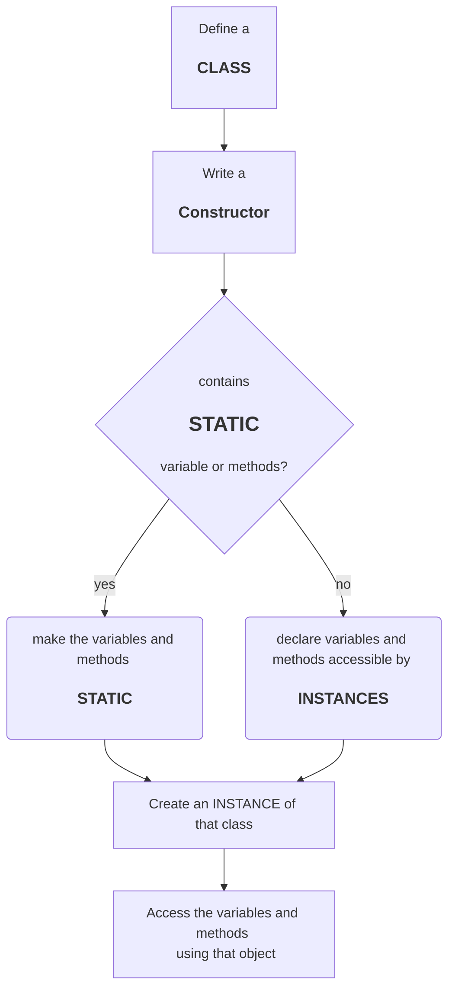

# TASK DAY 6

Today's task has four question each question has a general pattern where we need to follow these steps:



using the above template 4 classes namely,

1) Movie.js
2) Circle.js
3) Person.js
4) Uber.js

has been created and attached.

## MOVIE

Objective of the Movie class are of following:

* has a constructor which initializes 4 variables  
    1) _title_
    2) _studio_
    3) _rating (this has a default value of "PG")_
* has a method getPG whose ratings are only **"PG"**
  
## CIRCLE 

Objective of the Circle class are of following:  

* has a constructor which initializes 2 variables  
    1) _radius_
    2) _color_

* has getters and setters for both radius and color
* also has getArea and getCircumfrence to calculate area and circumfrence for the instance of Circle class
  
## PERSON

Objective of the Person class is to create a class that holds the details of a person and get the details whenever needed.

## UBER

Objective of the Movie class are of following:

* has a constructor which initialize  
    1) passenger name
    2) location
    3) destination
    4) distance(km)
    5) upAndDown(Boolean)
* it also has getUberPrice method whihc calculate the uber price in the following algorithm:

````mermaid
    graph TD;
    A["get DISTANCE"]-->B{CHECK distance};
    B--"distance<5"-->C[calculate price at rate of \n20 INR];
    B--"distance>5"-->D[calculate price at rate of \n20 INR for first 5 km\n25 INR for rest];
    C-->E;
    D-->E{check\nUP AND DOWN};
    E--"TRUE"-->F[return twice the price\n<h3>2 X PRICE]
    E--"FALSE"-->G[return price as it is\n<h3>1 X PRICE]

````